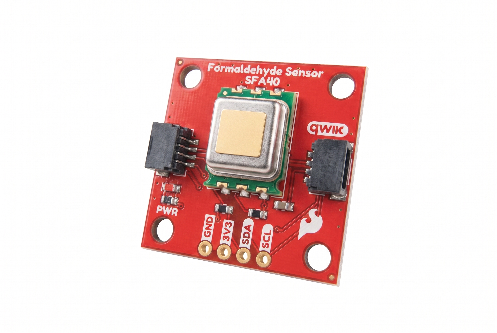

# SparkFun Qwiic Formaldehyde Sensor - SFA40

The SparkFun Qwiic Formaldehyde Sensor is a compact indoor air quality breakout built around the SFA40 from Sensirion.
The SFA40 is an electrochemical sensor that measures formaldehyde (HCHO) from 0 to 2000 ppb, with very low cross-sensitivity 
to common indoor gases like ethanol. It is factory-calibrated and outputs concentration directly over I2C, and an onboard 
humidity and temperature sensor compensates the reading automatically. We've wired it to Qwiic connectors so you can read 
calibrated formaldehyde levels with no soldering.

**Note:** The SFA40 needs about 10 minutes after power-on to reach full accuracy, and a status flag in each reading tells you when it is within spec.

## Repository Contents

* **/docs** - Documentation files for GitHub pages
* **/Documents** - Datasheets, additional product information
* **/Hardware** - KiCad design files (.kicad_sch, .kicad_pcb)
* **/Production** - Production panel files

## Documentation

* **[Library](https://github.com/sparkfun/SparkFun_SFA40_Arduino_Library)** - Arduino library for the SparkFun Qwiic Formaldehyde Sensor - SFA40.
* **[Hookup Guide](https://docs.sparkfun.com/SparkFun_Qwiic_Formaldehyde_Sensor_SFA40/)** - Basic hookup guide for the SparkFun Qwiic Formaldehyde Sensor - SFA40.

## Product Versions

* **[SEN-XXXXX](https://www.sparkfun.com/products/XXXXX)** - Initial release of the SparkFun Qwiic Formaldehyde Sensor - SFA40.

## License Information

This product is _**open source**_!

Please review the LICENSE.md file for license information.

If you have any questions or concerns about licensing, please contact technical support on our [SparkFun forums](https://forum.sparkfun.com/viewforum.php?f=152).

Distributed as-is; no warranty is given.

_- Your friends at SparkFun._
